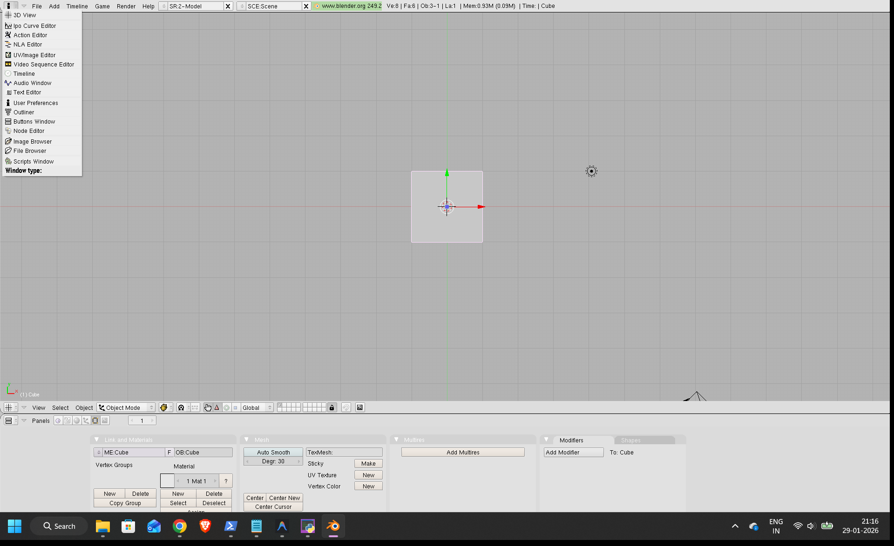
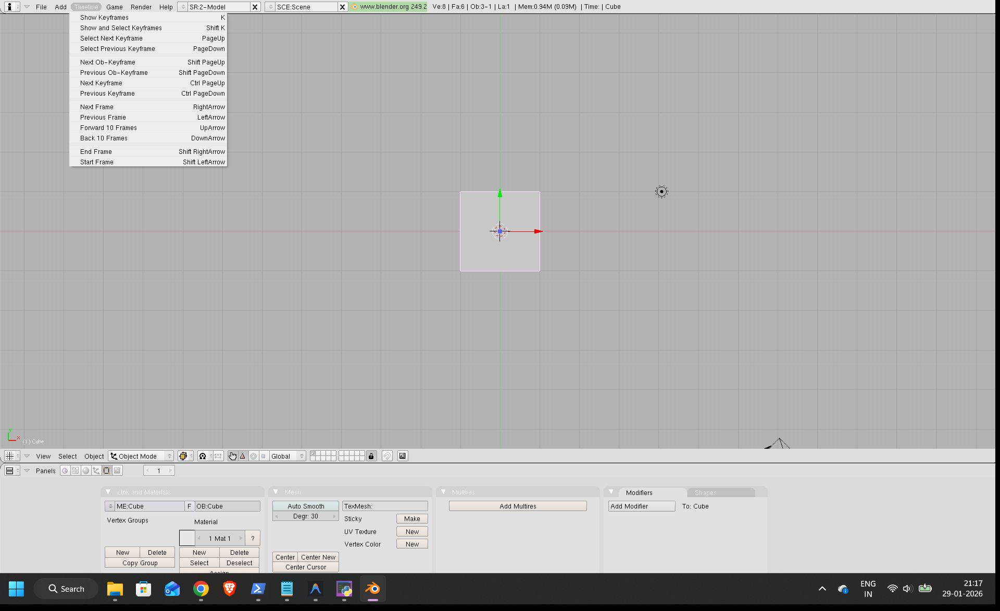
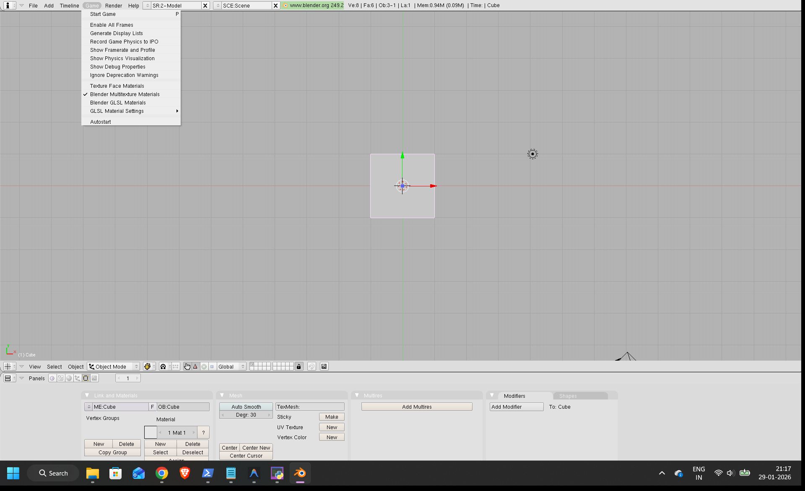
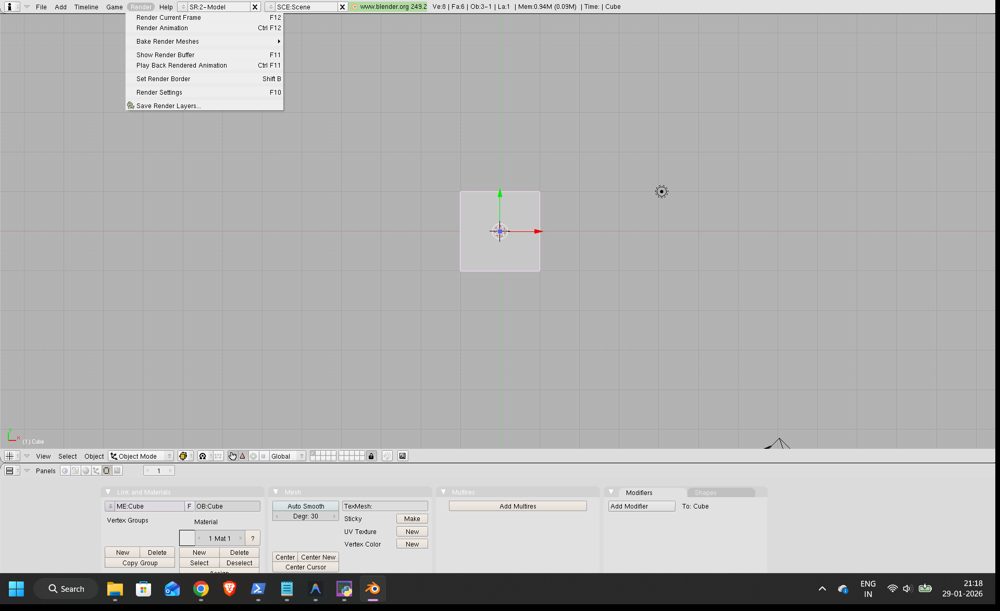
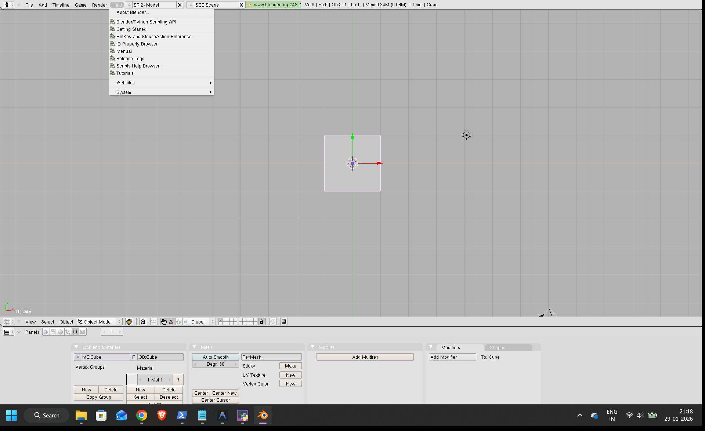
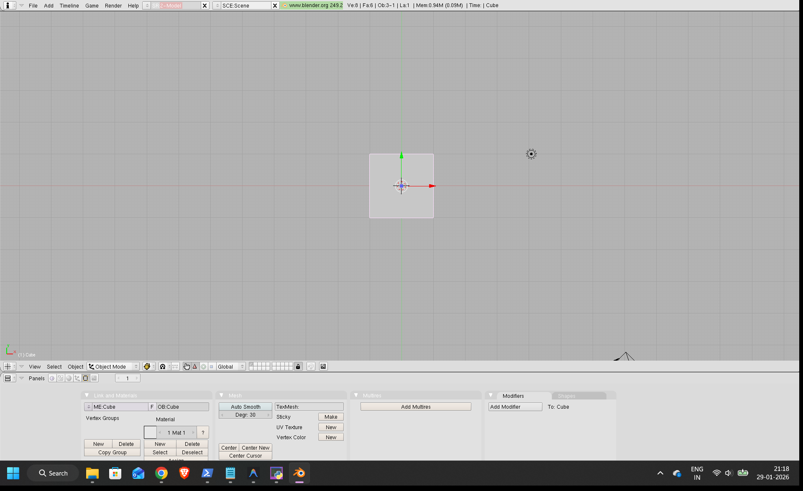

# Blender User Manual: A Comprehensive Guide to 3D Modeling and Animation (Blender 2.49)

Welcome to Blender! This manual will guide you through the powerful features of Blender, a free and open-source 3D creation suite. Whether you're a beginner taking your first steps into 3D art or looking to understand specific functionalities, this guide will help you navigate the Blender 2.49 interface and get started with your creative projects.

Blender 2.49 is a classic version known for its robust capabilities in modeling, sculpting, animation, rendering, compositing, and even game creation. While newer versions exist, understanding the fundamentals of this interface will provide a strong foundation for any 3D artist.

---

## 1. Getting Started

When you first launch Blender, you'll be greeted by the default workspace. This initial setup provides a 3D Viewport, which is your primary canvas for creating and manipulating 3D objects, along with other essential panels.

### 1.1 Application Start

**Figure 1.1: The default Blender 2.49 interface upon startup.**

Upon launching Blender, you'll typically see a large 3D Viewport in the center, a header bar at the top with various menus and information, and a "Buttons Window" (properties panel) at the bottom. A default cube, camera, and light source are usually present in the 3D scene.

---

## 2. Top Bar Menus: Your Command Center

The top header bar houses crucial menus that provide access to file operations, object creation, scene settings, rendering, and help resources.

### 2.1 File Menu

**Figure 2.1: The File menu.**

The **File** menu is where you manage your Blender projects:
*   **New:** Start a new empty scene.
*   **Open:** Load an existing Blender file (.blend).
*   **Save / Save As:** Save your current project.
*   **Append / Link:** Import elements from other .blend files.
*   **Import / Export:** Bring in or export 3D models in various formats (e.g., .obj, .3ds, .fbx).
*   **Quit:** Exit Blender.

### 2.2 Add Menu

**Figure 2.2: The Add menu.**

The **Add** menu allows you to introduce new objects into your 3D scene. This is fundamental for building your models and scenes:
*   **Mesh:** Add primitive mesh objects like Cubes, Spheres, Cylinders, Planes, etc. These are the building blocks for most models.
*   **Curve:** Add curve objects (e.g., Bezier, Nurbs) for creating paths, ropes, or intricate shapes that can be converted to meshes.
*   **Surface:** Add NURBS surfaces for smooth, organic shapes.
*   **Metaball:** Add dynamically merging objects.
*   **Text:** Add 3D text objects.
*   **Lamp:** Add various types of light sources (e.g., Point, Sun, Spot, Hemi, Area).
*   **Camera:** Add a camera to define your scene's view for rendering.
*   **Armature:** Add a skeleton for character rigging and animation.
*   **Empty:** Add an invisible object used as a parent for other objects or as a transformation reference.

### 2.3 Timeline Menu

**Figure 2.3: The Timeline menu.**

The **Timeline** menu provides controls related to animation playback and keyframes:
*   **Show and Select Keyframes:** Jump to or select keyframes.
*   **Previous/Next Frame/Keyframe:** Navigate through your animation frames.
*   **Start/End Frame:** Set the start and end points of your animation sequence.

### 2.4 Game Menu

**Figure 2.4: The Game menu.**

Blender 2.49 included a built-in game engine. The **Game** menu provides options for running and debugging your interactive 3D content:
*   **Start Game:** Launch your scene in the Blender Game Engine.
*   **Enable Display Lists:** Optimize rendering for game engine performance.
*   Other options for physics visualization, debugging, and material settings within the game engine.

### 2.5 Render Menu

**Figure 2.5: The Render menu.**

The **Render** menu is where you initiate the process of generating images or animations from your 3D scene:
*   **Render Current Frame (F12):** Generate an image of the current frame in your 3D Viewport.
*   **Render Animation (Ctrl+F12):** Render an entire animation sequence.
*   **Bake Render Meshes:** Calculate and store lighting information directly onto mesh textures.
*   **Show Render Buffer (F11):** View the last rendered image.
*   **Render Settings (F10):** Open the render properties panel to configure output format, resolution, anti-aliasing, and more.

### 2.6 Help Menu

**Figure 2.6: The Help menu.**

The **Help** menu provides quick access to Blender's documentation and community resources:
*   **About Blender:** Displays information about the Blender version.
*   **Getting Started:** Links to introductory guides.
*   **Manual / Reference:** Access the comprehensive Blender manual and hotkey references.
*   **Tutorials / Websites:** Links to online tutorials and the official Blender website.

---

## 3. Top Bar Dropdowns: Contextual Controls

Beyond the main menus, the top bar features several dropdowns that allow you to quickly change scene contexts, view presets, and application information.

### 3.1 Viewport Preset / View Mode (SR.2-Model)

**Figure 3.1: The SR.2-Model dropdown.**

This dropdown likely allows you to switch between different viewport shading or display modes, or perhaps stored viewport layouts/presets designed for specific tasks (e.g., "Model" for modeling, "Sculpt" for sculpting, etc.). The exact options would depend on your Blender configuration and what presets are available.

### 3.2 Scene Selector (SCE:Scene)

**Figure 3.2: The SCE:Scene dropdown.**

The **SCE:Scene** dropdown lets you manage different scenes within your Blender file. You can:
*   **Add new scenes:** Create entirely separate 3D environments within the same .blend file.
*   **Select existing scenes:** Switch between your created scenes.
*   **Delete scenes:** Remove unwanted scenes.
This is useful for organizing complex projects.

### 3.3 Blender Version and Website Link

**Figure 3.3: The www.blender.org 249.2 dropdown.**

This section of the header displays information about the Blender version you are using (in this case, 2.49.2). Clicking on it might offer quick links to the official Blender website (`www.blender.org`) for news, downloads, and documentation.

---

## 4. Window Types: Customizing Your Layout

Blender's interface is highly customizable. You can split existing windows and change their type to create a workspace tailored to your current task. The dropdown menu for changing a window's type is found in the bottom-left corner of each window.

### 4.1 Changing Window Type

**Figure 4.1: The window type dropdown menu.**

To change the type of any window, simply click the leftmost icon in its header. This will reveal a comprehensive list of available window types. Let's explore some of the most common and important ones:

### 4.2 3D View

**Figure 4.2: The 3D View.**

The **3D View** is where you create, view, and manipulate your 3D models. It's the central hub for most of your work, allowing you to move, rotate, scale objects, sculpt, and paint.

### 4.3 IPO Curve Editor

**Figure 4.3: The IPO Curve Editor.**

The **IPO Curve Editor** (Interpolation Parameter Object) is crucial for animation. It allows you to visualize and edit the animation curves (keyframes) for an object's location, rotation, scale, and other properties over time, giving you fine control over movement and timing.

### 4.4 Action Editor

**Figure 4.4: The Action Editor.**

The **Action Editor** is used to create and manage "Actions" – reusable animation clips, particularly useful for character animation. You can define a walk cycle, a jump, or a wave as separate actions and then combine them.

### 4.5 NLA Editor

**Figure 4.5: The NLA Editor.**

The **NLA Editor** (Non-Linear Animation) allows you to blend, layer, and reuse "Actions" created in the Action Editor. It's similar to a video editing timeline but for animation clips, enabling complex character performances.

### 4.6 UV/Image Editor

**Figure 4.6: The UV/Image Editor.**

The **UV/Image Editor** is essential for texturing. It allows you to unwrap your 3D models into 2D UV maps and then apply and paint textures directly onto them. You can also view and edit images here.

### 4.7 Video Sequence Editor

**Figure 4.7: The Video Sequence Editor.**

The **Video Sequence Editor (VSE)** is a non-linear video editing tool built into Blender. You can combine rendered animations, video clips, images, and audio, and add effects and transitions.

### 4.8 Timeline

**Figure 4.8: The Timeline.**

The **Timeline** provides a high-level overview of your animation and allows for playback control, setting keyframes, and navigating through frames. It's a fundamental window for any animation project.

### 4.9 Audio Window

**Figure 4.9: The Audio Window.**

The **Audio Window** is where you can load and manage audio files for your animation or game projects. It allows for basic audio editing and synchronization with your visuals.

### 4.10 Text Editor

**Figure 4.10: The Text Editor.**

The **Text Editor** can be used for writing and executing Python scripts (Blender's scripting language), storing notes about your project, or even creating 3D text objects from text data.

### 4.11 User Preferences

**Figure 4.11: The User Preferences window.**

The **User Preferences** window is where you customize Blender's behavior and appearance. You can adjust input settings, themes, addon management, file paths, and system settings to personalize your experience.

### 4.12 Outliner

**Figure 4.12: The Outliner.**

The **Outliner** provides a hierarchical list of all objects, collections, and data blocks in your scene. It's an excellent tool for organizing complex scenes, selecting objects, and managing visibility.

### 4.13 Buttons Window (Properties Panel)

**Figure 4.13: The Buttons Window.**

Often referred to as the **Properties Panel** in later versions, the **Buttons Window** is where you find most of the detailed settings and properties for selected objects, scenes, rendering, and materials. It's context-sensitive, changing its content based on what you have selected.

### 4.14 Node Editor

**Figure 4.14: The Node Editor.**

The **Node Editor** is used for advanced material creation (connecting textures, shaders, and effects) and compositing (post-processing images and animations with a nodal workflow).

### 4.15 Image Browser

**Figure 4.15: The Image Browser.**

The **Image Browser** allows you to navigate and select images from your file system. It's particularly useful when working with textures in the UV/Image Editor or backgrounds.

### 4.16 File Browser

**Figure 4.16: The File Browser.**

The **File Browser** provides a standard interface for opening, saving, and managing files on your computer. It's used for loading Blender files, importing assets, and exporting your final renders.

### 4.17 Scripts Window

**Figure 4.17: The Scripts Window.**

The **Scripts Window** is dedicated to running Python scripts. It offers tools for script editing, debugging, and managing your custom Blender scripts.

---

## 5. 3D Viewport Menus: Object Interaction

Within the 3D Viewport, a dedicated header bar (just below the main top bar) provides menus and tools specific to manipulating objects in the 3D space.

### 5.1 View Menu (3D View)

**Figure 5.1: The View menu within the 3D Viewport.**

This **View** menu (local to the 3D View) offers options for controlling your perspective and display settings:
*   **Toggle Quad View:** Split the 3D View into four panels (top, front, side, camera).
*   **Toggle Full Screen:** Maximize the 3D View.
*   **Viewport Shading:** Switch between Wireframe, Solid, Textured, Bounded, etc.
*   **Camera Controls:** Align view to active camera, orbit, pan, zoom.
*   **Properties Panel (N-panel):** Toggle the side panel for item transforms and tool settings.

### 5.2 Select Menu (3D View)

**Figure 5.2: The Select menu within the 3D Viewport.**

The **Select** menu provides various methods for selecting objects and their components (vertices, edges, faces) in the 3D View:
*   **Select All / None (A):** Select or deselect everything.
*   **Border Select (B):** Drag a box to select.
*   **Circle Select (C):** Paint a selection with a circle brush.
*   **Select Linked (L):** Select all connected geometry.
*   **Invert (Ctrl+I):** Invert the current selection.

### 5.3 Object Menu (3D View)

**Figure 5.3: The Object menu within the 3D Viewport.**

The **Object** menu offers operations specifically for objects in your scene:
*   **Transform:** Move (G), Rotate (R), Scale (S) selected objects.
*   **Duplicate (Shift+D):** Create a copy of the selected object.
*   **Apply:** Apply transformations (location, rotation, scale) to an object's data.
*   **Parent:** Establish a hierarchical relationship between objects.
*   **Join (Ctrl+J):** Combine multiple selected mesh objects into a single object.
*   **Delete (X/Del):** Remove the selected object(s) from the scene.
*   **Show/Hide (H/Alt+H):** Toggle visibility of objects.

---

## 6. Tips for Beginners

*   **Learn Hotkeys:** Blender is heavily reliant on keyboard shortcuts. Learning them will significantly speed up your workflow. Start with basic navigation (Middle Mouse Button to orbit, Shift+MMB to pan, Scroll Wheel to zoom).
*   **Save Frequently:** Blender files can sometimes crash. Save your work often (Ctrl+S).
*   **Explore:** Don't be afraid to click buttons and try things out. Blender is designed for experimentation.
*   **Online Resources:** The Blender community is vast! Utilize the official Blender website (`www.blender.org`) for documentation and tutorials. YouTube and other platforms host countless tutorials for every skill level.
*   **Undo (Ctrl+Z):** Made a mistake? Undo is your friend!
*   **Context is Key:** Many menus and properties change based on what object you have selected or what mode you are in (e.g., Object Mode vs. Edit Mode). Pay attention to the labels and options.

---

## Conclusion

This manual has provided a foundational understanding of Blender 2.49's interface and core functionalities. By familiarizing yourself with these menus, window types, and basic operations, you are well-equipped to start your journey into the exciting world of 3D modeling and animation. Happy Blending!