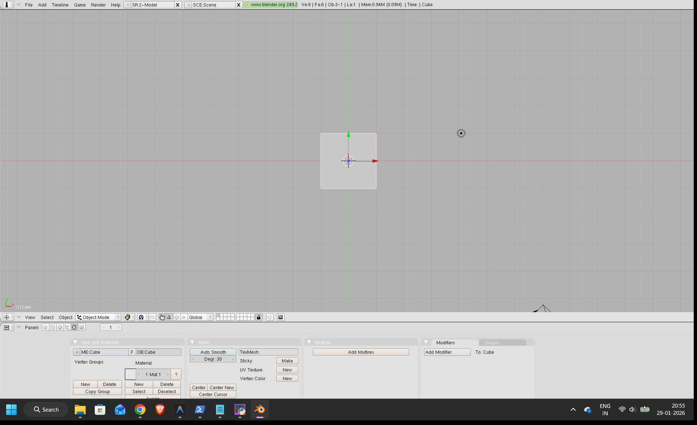
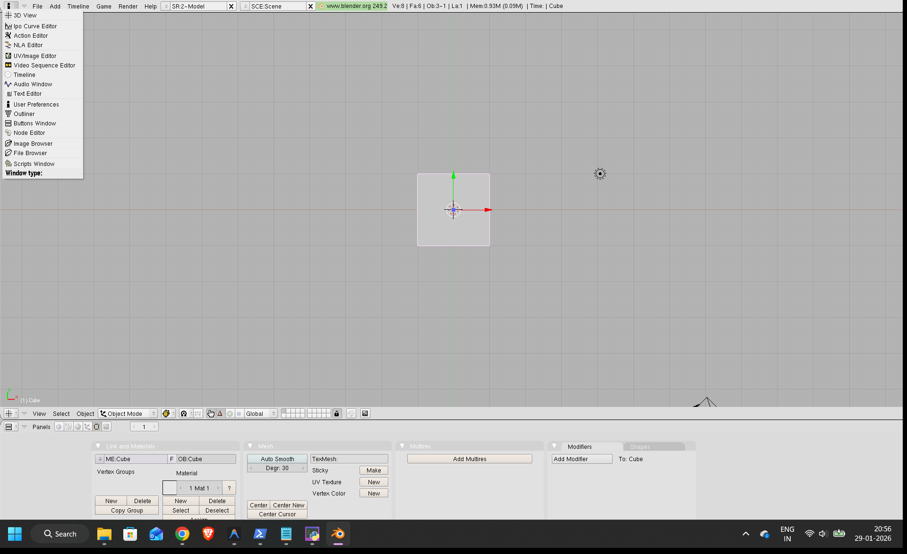
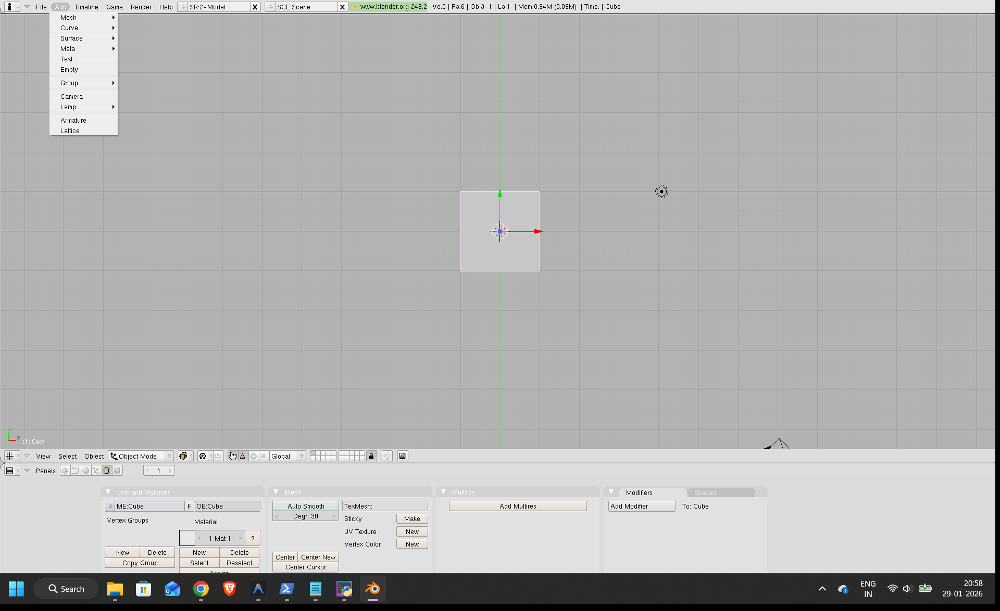
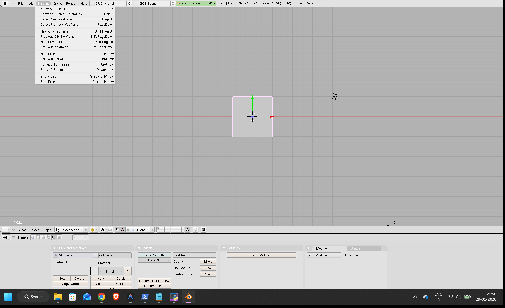
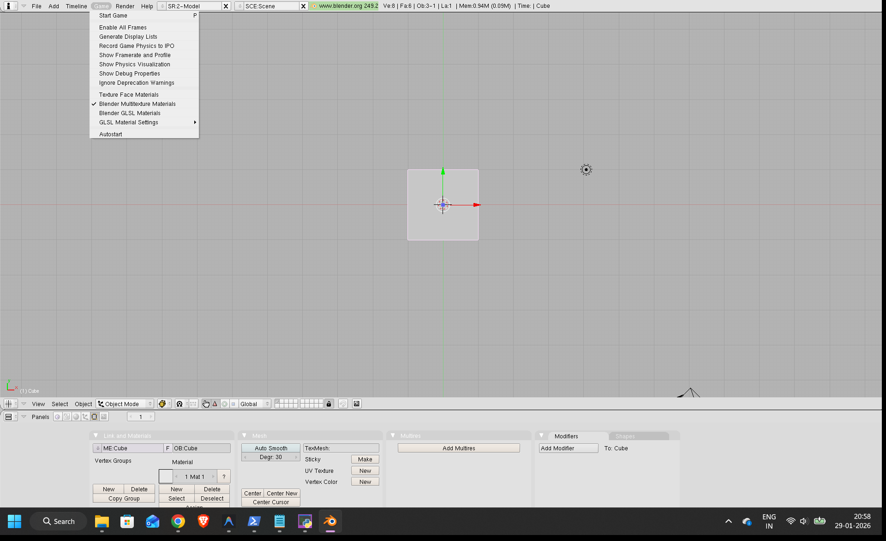
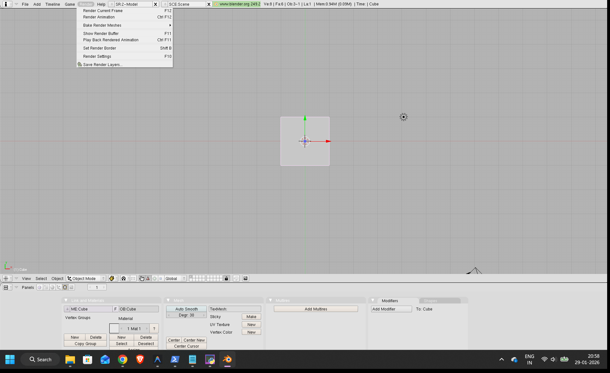
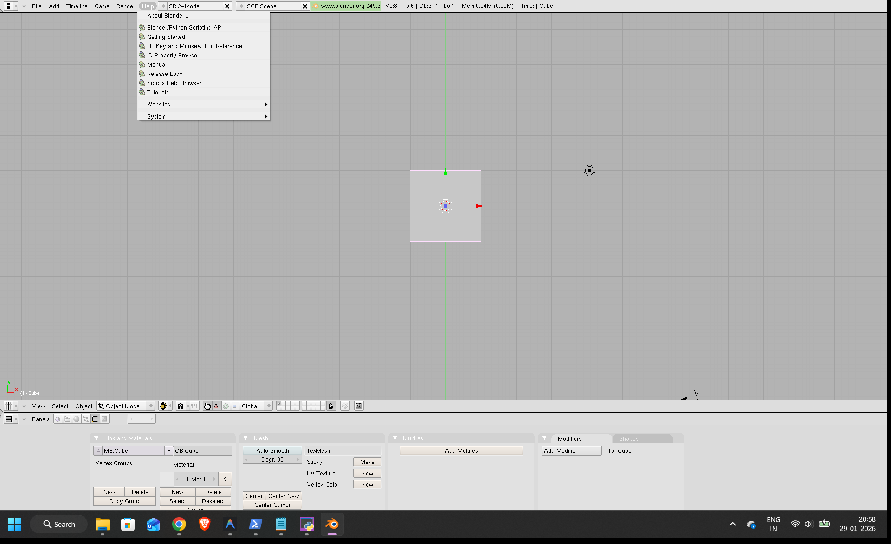
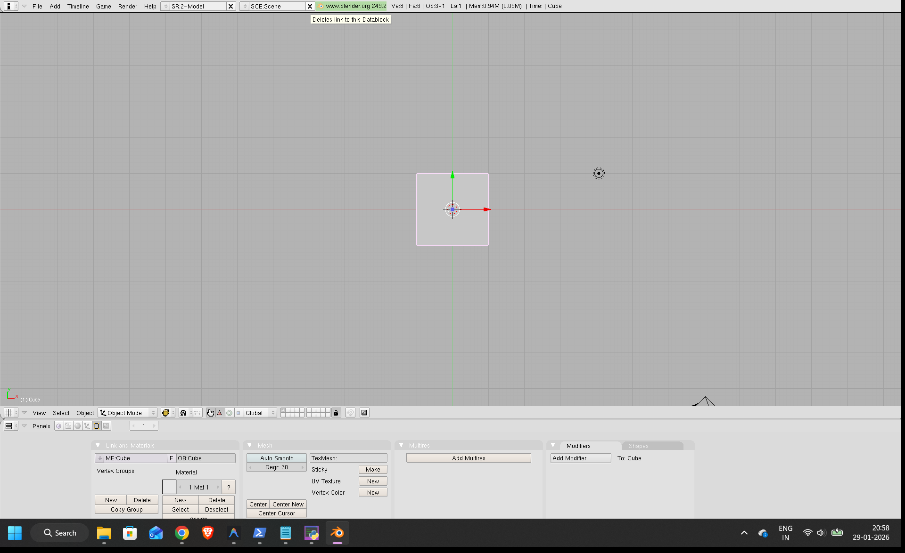
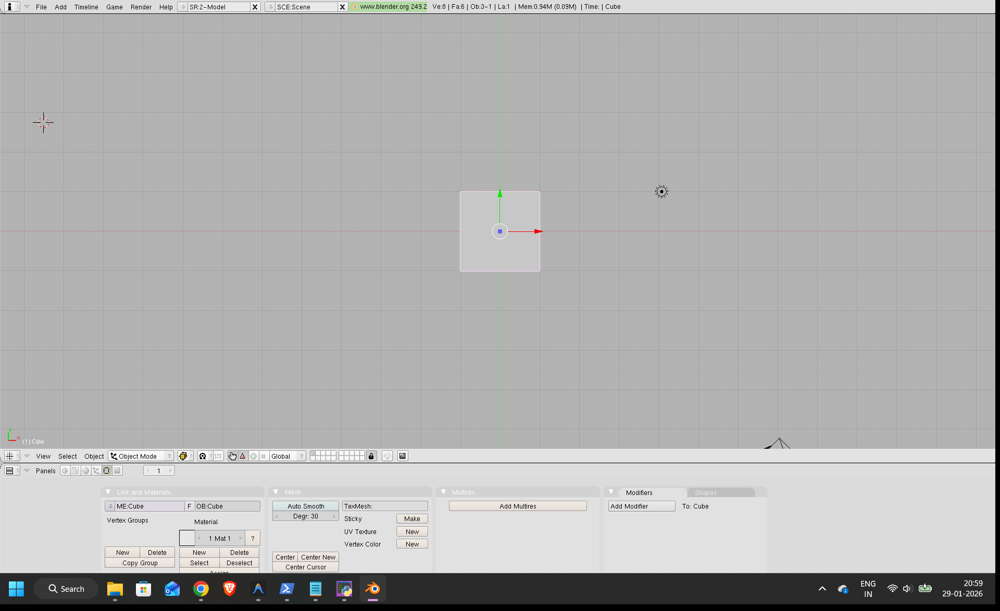

# Blender User Manual: 3D Modeling and Animation Software

Welcome to Blender, your powerful open-source solution for 3D creation! This manual will guide you through the fundamental aspects of Blender, helping you get started with 3D modeling, animation, rendering, and more.

## Table of Contents
1.  [Getting Started](#1-getting-started)
    *   [Launching Blender](#launching-blender)
    *   [Understanding the Interface](#understanding-the-interface)
2.  [The Top Menu Bar: Core Functions](#2-the-top-menu-bar-core-functions)
    *   [File Menu](#file-menu)
    *   [Add Menu](#add-menu)
    [Timeline Menu](#timeline-menu)
    *   [Game Menu](#game-menu)
    *   [Render Menu](#render-menu)
    *   [Help Menu](#help-menu)
    *   [Top Tabs: Data Blocks and Contexts](#top-tabs-data-blocks-and-contexts)
3.  [Window Types: Tailoring Your Workspace](#3-window-types-tailoring-your-workspace)
    *   [Changing Window Types](#changing-window-types)
    *   [Exploring Different Window Types](#exploring-different-window-types)
4.  [3D Viewport Controls](#4-3d-viewport-controls)
    *   [View Options](#view-options)
    *   [Selection Tools](#selection-tools)
    *   [Object Menu](#object-menu)
    *   [Interaction Modes](#interaction-modes)
5.  [Tips for Beginners](#5-tips-for-beginners)
6.  [Conclusion](#6-conclusion)

---

## 1. Getting Started

### Launching Blender
When you first open Blender, you'll be presented with a default scene. This scene typically includes a cube, a camera, and a light source, providing a starting point for your 3D projects.

*Figure 1: The default Blender interface upon launch.*

The Blender interface is highly customizable, but it generally consists of several key areas:
*   **Top Menu Bar**: Contains global menus like File, Add, Timeline, Game, Render, and Help.
*   **Info Bar (Top Middle)**: Displays information about the current scene, open data blocks (like `.blend` files or web pages), and memory usage.
*   **3D Viewport (Main Area)**: Where you interact with your 3D models, scenes, and animations.
*   **Properties/Buttons Window (Bottom Area)**: This area dynamically changes based on your selection and active tools, providing detailed controls and settings. In the default layout shown, it's displaying properties related to materials, mesh, and modifiers for the selected object (the Cube).

### Understanding the Interface
Blender's interface is designed to be flexible. You can resize, split, and change the type of any window to suit your workflow.

## 2. The Top Menu Bar: Core Functions

The menu bar at the very top of the Blender window provides access to the application's core functionalities.

### File Menu
The `File` menu is your gateway to managing your Blender projects.

*Figure 2: The 'File' menu dropdown.*

Here you can:
*   **New**: Start a new project.
*   **Open**: Load an existing Blender file (`.blend`).
*   **Save/Save As**: Save your current work.
*   **Import/Export**: Bring in or send out 3D models in various formats (e.g., FBX, OBJ).
*   **User Preferences**: Customize Blender's settings to your liking. (More on this later in Section 3).

### Add Menu
The `Add` menu is crucial for populating your 3D scene with various objects.

*Figure 3: The 'Add' menu dropdown.*

From this menu, you can add different types of objects to your scene, including:
*   **Mesh**: Primitives like cubes, spheres, cylinders, planes, etc., which form the basis of most 3D models.
*   **Curve**: Bezier curves, NURBS curves, and paths for creating organic shapes or animation paths.
*   **Surface**: NURBS surfaces for complex, smooth forms.
*   **Meta**: Metaballs for organic, fluid-like shapes.
*   **Text**: Add 3D text objects.
*   **Empty**: Placeholder objects useful for grouping, positioning, and animation.
*   **Group**: Create reusable groups of objects.
*   **Armature**: Add bone structures for character rigging and animation.
*   **Lamp**: Add light sources (e.g., Point, Sun, Spot, Hemi, Area).
*   **Camera**: Add cameras to define your render views.
*   **Lattice**: Deform objects with a non-destructive grid.

### Timeline Menu
The `Timeline` menu offers controls related to animation playback and keyframes.

*Figure 4: The 'Timeline' menu dropdown.*

Key features here include:
*   **Show and Select Keyframes**: Manage keyframes for animated properties.
*   **Previous/Next Keyframe**: Navigate through your animation.
*   **Start/End Frame**: Set the beginning and end of your animation playback.

### Game Menu
Blender includes a built-in game engine (though its functionality and presence might vary in newer versions, as it was removed in Blender 2.80+). This menu provides options for interactive 3D content.

*Figure 5: The 'Game' menu dropdown.*

Using the Game menu, you can:
*   **Start Game**: Play your interactive 3D scene directly within Blender.
*   **Enable All Frames**: Ensure all frames are processed for game logic.
*   **Show Physics Visualization**: Debug physics interactions in your game.

### Render Menu
The `Render` menu is where you initiate the process of generating images or animations from your 3D scene.

*Figure 6: The 'Render' menu dropdown.*

From this menu, you can:
*   **Render Current Frame**: Generate a still image of the current frame (shortcut: `F12`).
*   **Render Animation**: Generate a sequence of images or a video file for your animation (shortcut: `Ctrl + F12`).
*   **Render Settings**: Access the panel to configure resolution, output format, render engine, and other crucial render options.
*   **Show Render Buffer**: View the last rendered image.

### Help Menu
The `Help` menu provides access to Blender's documentation, tutorials, and support resources.

*Figure 7: The 'Help' menu dropdown.*

Useful options include:
*   **About Blender**: Information about your Blender version.
*   **Getting Started**: Links to beginner resources.
*   **Manual**: Access the comprehensive Blender manual online.
*   **Tutorials**: Links to official and community tutorials.
*   **Websites**: Quick links to blender.org and other related sites.

### Top Tabs: Data Blocks and Contexts
Above the main viewport, you might see several tabs. These represent different data blocks or contexts open within Blender.

*Figure 8: A data block tab, possibly a linked model or external asset.*

*Figure 9: The 'SCE:Scene' tab, representing your current 3D scene.*

*Figure 10: An integrated web browser tab for documentation.*

These tabs allow you to quickly switch between different blend files, scenes, or even an embedded web browser for documentation directly within Blender. Clicking an "X" on a tab will close that data block or browser window.

## 3. Window Types: Tailoring Your Workspace

Blender's interface is made up of "windows" (also called areas). Each window can be set to display a different editor type, allowing you to customize your layout for various tasks.

### Changing Window Types
To change a window's type, locate the dropdown menu at the bottom-left corner of each window.

*Figure 11: The dropdown for changing a window's editor type.*

Clicking this icon will reveal a list of all available editor types, allowing you to transform that section of the interface into a specialized tool.

### Exploring Different Window Types
Here's a brief overview of some essential editor types you can switch to:

*   **3D View**: The primary editor for manipulating 3D objects, cameras, and lights.
    
    *Figure 12: The 3D Viewport editor type.*

*   **Ipo Curve Editor** (now typically called **Graph Editor** in modern Blender): Used for editing animation curves (interpolated position, rotation, scale, etc.) to fine-tune motion.
    
    *Figure 13: The Ipo Curve (Graph) Editor editor type.*

*   **Action Editor**: Manages actions (reusable animation data blocks) for characters or objects.
    
    *Figure 14: The Action Editor editor type.*

*   **NLA Editor** (Non-Linear Animation): Allows blending and looping of animation actions to create complex sequences.
    
    *Figure 15: The NLA Editor editor type.*

*   **UV/Image Editor**: For unwrapping 3D models into 2D UV maps and painting textures directly onto them. Also used for image manipulation.
    
    *Figure 16: The UV/Image Editor editor type.*

*   **Video Sequence Editor**: A non-linear video editing tool for cutting, splicing, and compositing video and audio.
    
    *Figure 17: The Video Sequence Editor editor type.*

*   **Timeline**: Displays the keyframes and playback controls for your animation.
    
    *Figure 18: The Timeline editor type.*

*   **Audio Window**: (Less common as a standalone window in modern Blender, often integrated into other editors like VSE or NLA). For audio specific controls.
    
    *Figure 19: The Audio Window editor type.*

*   **Text Editor**: For writing and editing Python scripts or general text.
    
    *Figure 20: The Text Editor editor type.*

*   **User Preferences**: Access Blender's extensive settings, including interface, input, themes, and add-ons.
    
    *Figure 21: The User Preferences editor type.*

*   **Outliner**: Displays a hierarchical list of all objects, collections, and data blocks in your scene, useful for organization and selection.
    
    *Figure 22: The Outliner editor type.*

*   **Buttons Window** (now typically called **Properties Editor**): Contains all the detailed properties and settings for selected objects, tools, modifiers, materials, etc. This is usually the large window at the bottom or side in default layouts.
    
    *Figure 23: The Buttons Window (Properties Editor) editor type.*

*   **Node Editor**: For creating complex materials, textures, and compositing effects using a visual node-based workflow.
    
    *Figure 24: The Node Editor editor type.*

*   **Image Browser**: For browsing and managing images used in your project.
    
    *Figure 25: The Image Browser editor type.*

*   **File Browser**: A built-in file explorer for opening, saving, and managing files within Blender.
    
    *Figure 26: The File Browser editor type.*

*   **Scripts Window** (now typically integrated into Text Editor or specific script panels): For managing and running Python scripts.
    
    *Figure 27: The Scripts Window editor type.*

## 4. 3D Viewport Controls

The header bar of the 3D Viewport (usually found at the bottom of the viewport in the provided screenshots) contains specific controls for interacting with your 3D scene.

### View Options
The `View` menu within the 3D Viewport header controls how you perceive your scene.

*Figure 28: The 'View' menu in the 3D Viewport header.*

This menu allows you to:
*   **Toggle various overlays**: Like grid, axes, names, etc.
*   **Align View**: Quickly snap the camera to standard views (front, top, side, camera view).
*   **Frame All/Selected**: Zoom the viewport to show all objects or only selected ones.
*   **View Properties**: Access settings specific to the 3D viewport.

### Selection Tools
The `Select` menu provides various methods for choosing objects or components within your scene.

*Figure 29: The 'Select' menu in the 3D Viewport header.*

Options here include:
*   **Border Select**: Drag a box to select multiple items.
*   **Circle Select**: Use a circular brush to select.
*   **Select All/None**: Quickly select or deselect everything.
*   **Inverse**: Invert your current selection.

### Object Menu
The `Object` menu applies operations to selected objects in `Object Mode`.

*Figure 30: The 'Object' menu in the 3D Viewport header.*

Common operations include:
*   **Transform**: Apply transformations (location, rotation, scale).
*   **Mirror**: Mirror objects.
*   **Duplicate**: Create copies of objects.
*   **Join/Separate**: Combine multiple objects into one, or split an object into parts.
*   **Set Origin**: Change the object's pivot point.

### Interaction Modes
Blender has different interaction modes, each optimized for specific tasks. The most common modes are `Object Mode` and `Edit Mode`.

*Figure 31: The 'Object Mode' dropdown, allowing you to switch interaction modes.*

*   **Object Mode**: This is the default mode where you select and manipulate whole objects (e.g., move a cube, rotate a camera).
*   **Edit Mode**: In this mode, you can select and manipulate an object's individual components (vertices, edges, faces) to change its shape.
*   Other modes exist for specific tasks, such as **Sculpt Mode** (for organic modeling), **Weight Paint Mode** (for character rigging), **Texture Paint Mode** (for painting directly on models), and more.

## 5. Tips for Beginners

*   **Explore Keyboard Shortcuts**: Blender relies heavily on shortcuts. Learning a few essential ones (e.g., `G` for Grab/Move, `R` for Rotate, `S` for Scale, `Tab` to switch between Object/Edit Mode) will significantly speed up your workflow.
*   **Save Frequently**: Blender can be demanding on your system. Save your work often (`Ctrl+S`).
*   **Utilize the Manual**: The official Blender manual (accessible via the `Help` menu) is a vast resource.
*   **Watch Tutorials**: Many excellent free tutorials are available online (YouTube, blender.org) that can teach specific techniques and workflows.
*   **Don't Be Afraid to Experiment**: The best way to learn Blender is by trying things out. If you make a mistake, `Ctrl+Z` (Undo) is your friend!
*   **Customize Your Workspace**: As you become more familiar, customize your window layouts and shortcuts to fit your personal workflow.

## 6. Conclusion

Blender is a deep and powerful tool, but with this basic understanding of its interface and core functionalities, you're well on your way to creating amazing 3D art and animations. Keep exploring, keep learning, and most importantly, have fun creating!