# GitHub Desktop User Manual

## Table of Contents
1.  [Introduction](#1-introduction)
2.  [Getting Started with GitHub Desktop](#2-getting-started-with-github-desktop)
    2.1. [Main Interface Overview](#21-main-interface-overview)
    2.2. [Creating a New Repository](#22-creating-a-new-repository)
    2.3. [Adding an Existing Local Repository](#23-adding-an-existing-local-repository)
    2.4. [Cloning a Repository](#24-cloning-a-repository)
3.  [Navigating the Interface](#3-navigating-the-interface)
    3.1. [Top Bar Elements](#31-top-bar-elements)
        3.1.1. [Current Repository Selector](#311-current-repository-selector)
        3.1.2. [Current Branch Selector](#312-current-branch-selector)
        3.1.3. [Fetch Origin Button](#313-fetch-origin-button)
    3.2. [Views Panel (Left Sidebar)](#32-views-panel-left-sidebar)
        3.2.1. [Changes View](#321-changes-view)
        3.2.2. [History View](#322-history-view)
        3.2.3. [Branches View](#323-branches-view)
        3.2.4. [Filtering Files in Changes View](#324-filtering-files-in-changes-view)
    3.3. [Commit Area](#33-commit-area)
        3.3.1. [Summary and Description](#331-summary-and-description)
        3.3.2. [Adding Co-authors and Emojis](#332-adding-co-authors-and-emojis)
        3.3.3. [Committing Changes](#333-committing-changes)
4.  [Menu Bar Reference](#4-menu-bar-reference)
    4.1. [File Menu](#41-file-menu)
    4.2. [Edit Menu](#42-edit-menu)
    4.3. [View Menu](#43-view-menu)
    4.4. [Repository Menu](#44-repository-menu)
    4.5. [Branch Menu](#45-branch-menu)
    4.6. [Help Menu](#46-help-menu)
5.  [Core Workflow: Managing Your Code](#5-core-workflow-managing-your-code)
    5.1. [Inspecting and Staging Changes](#51-inspecting-and-staging-changes)
    5.2. [Committing Changes](#52-committing-changes)
    5.3. [Syncing with Remote: Fetch, Pull, Push](#53-syncing-with-remote-fetch-pull-push)
    5.4. [Branch Management Operations](#54-branch-management-operations)
        5.4.1. [Switching Branches](#541-switching-branches)
        5.4.2. [Creating a New Branch](#542-creating-a-new-branch)
        5.4.3. [Comparing and Merging Branches](#543-comparing-and-merging-branches)
        5.4.4. [Discarding and Stashing Changes](#544-discarding-and-stashing-changes)
        5.4.5. [Working with Pull Requests](#545-working-with-pull-requests)
6.  [Advanced Features and Settings](#6-advanced-features-and-settings)
    6.1. [Application Options](#61-application-options)
    6.2. [Repository Settings](#62-repository-settings)
    6.3. [External Editor Integration](#63-external-editor-integration)
7.  [Troubleshooting and Support](#7-troubleshooting-and-support)

---

# GitHub Desktop User Manual

## 1. Introduction

GitHub Desktop is a free, open-source application that simplifies the Git workflow for developers using a visual user interface. It allows you to interact with repositories hosted on GitHub.com or GitHub Enterprise, as well as local repositories, without needing to use the command line. This manual provides a comprehensive guide to using GitHub Desktop, covering its interface, core features, and advanced functionalities to help you manage your code effectively.

## 2. Getting Started with GitHub Desktop

This section will guide you through the initial steps of setting up and interacting with repositories using GitHub Desktop.

### 2.1. Main Interface Overview

Upon launching GitHub Desktop, you are presented with the main interface, which serves as your central hub for repository management.

**Figure 2.1: Main Application Interface**

The main interface is divided into several key areas:
*   **Top Bar:** Displays the current repository, current branch, and remote synchronization status.
*   **Left Sidebar:** Contains tabs for "Changes" and "History," allowing you to view uncommitted changes and commit history. It also includes the commit summary and description input fields.
*   **Main Content Area:** Displays details based on the selected view (e.g., suggested actions when no local changes exist, or file differences).

### 2.2. Creating a New Repository

You can create a new local Git repository directly from GitHub Desktop.

**To create a new repository:**
1.  Navigate to the **File** menu.
2.  Select **New repository...**.

**Figure 2.2: Creating a New Repository**

3.  A dialog will appear where you can specify the repository name, local path, and other options (e.g., `README` file, `.gitignore`).
4.  Click **Create Repository** to finalize.

### 2.3. Adding an Existing Local Repository

If you have a Git repository already present on your local machine, you can add it to GitHub Desktop for easier management.

**To add an existing local repository:**
1.  Navigate to the **File** menu.
2.  Select **Add local repository...**.

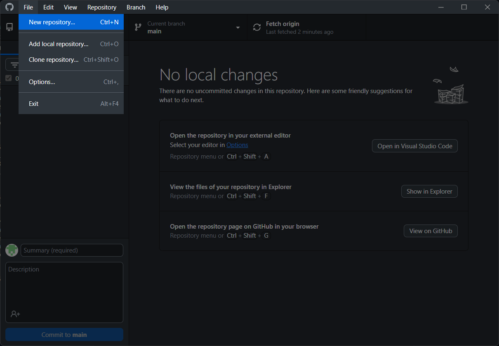
**Figure 2.3: Adding an Existing Local Repository**

3.  Browse to the directory of your local Git repository and select it.
4.  Click **Add Repository**.

### 2.4. Cloning a Repository

Cloning a repository allows you to download a copy of a remote repository (from GitHub.com or a URL) to your local machine.

**To clone a repository:**
1.  Navigate to the **File** menu.
2.  Select **Clone repository...**.

**Figure 2.4: Cloning a Repository**

3.  In the dialog, you can choose to clone from GitHub.com, GitHub Enterprise, or by URL. Select the desired repository and local path.
4.  Click **Clone**.

## 3. Navigating the Interface

This section details the primary interactive elements within the GitHub Desktop interface.

### 3.1. Top Bar Elements

The top bar provides quick access to repository-level actions and information.

#### 3.1.1. Current Repository Selector

The dropdown at the top left displays the currently active repository. Click on it to switch between your added local or cloned repositories.

**Figure 3.1: Current Repository Selector (Top Left)**

#### 3.1.2. Current Branch Selector

The "Current branch" dropdown, located in the center of the top bar, indicates the branch you are currently working on. You can click this dropdown to view available branches and switch to a different one.

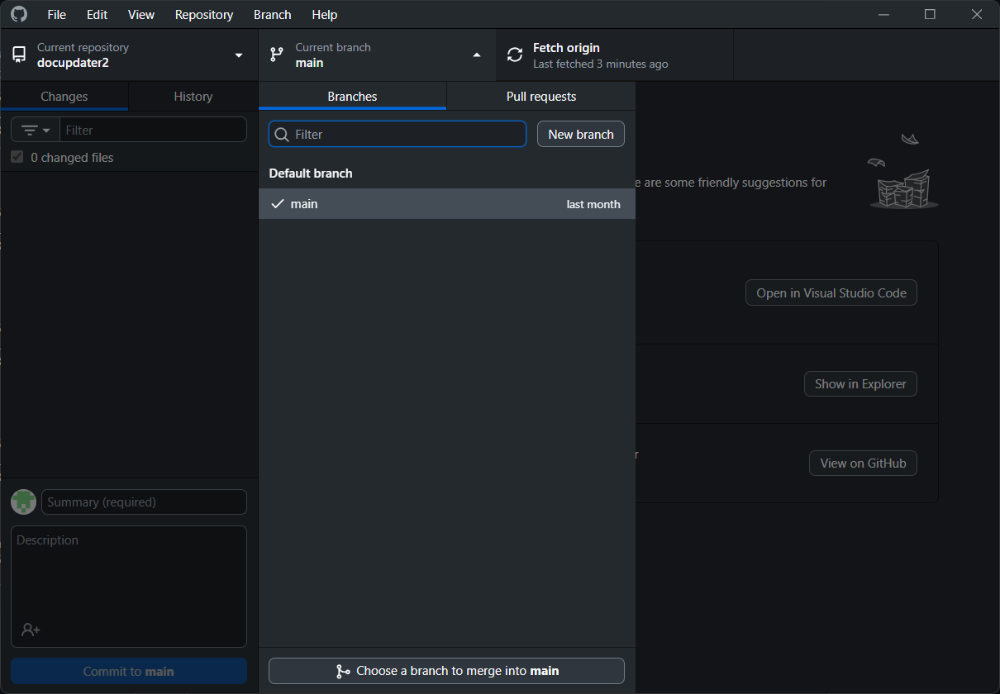
**Figure 3.2: Current Branch Selector**

#### 3.1.3. Fetch Origin Button

The **Fetch origin** button checks the remote repository for any new commits or branches that have been added by others. This operation downloads new data but does not merge it into your local branch.

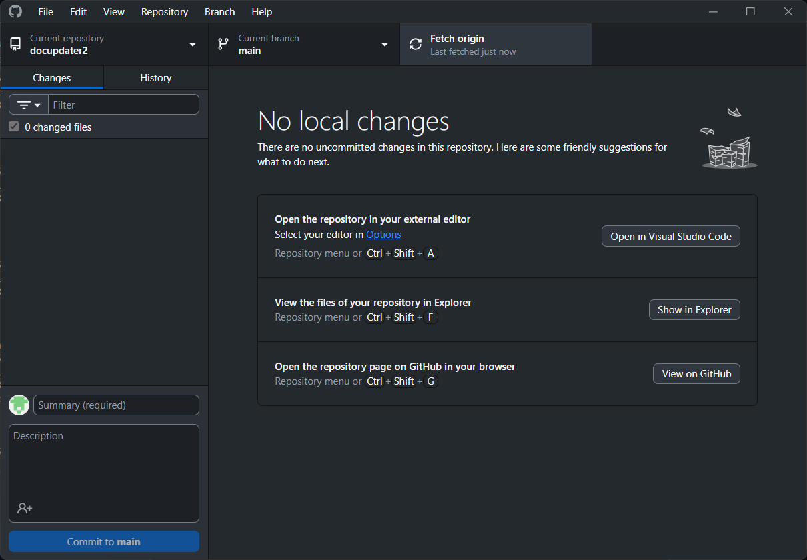
**Figure 3.3: Fetch Origin Button**

The text next to the button indicates when the last fetch occurred.

### 3.2. Views Panel (Left Sidebar)

The left sidebar primarily consists of the **Changes** and **History** tabs, which allow you to manage your repository's state.

#### 3.2.1. Changes View

The **Changes** view displays all modifications made to files in your working directory since the last commit. This includes new files, modified files, and deleted files.

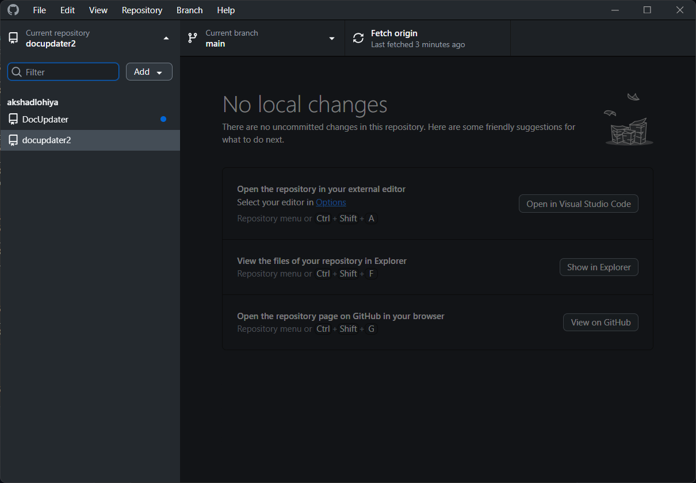
**Figure 3.4: Changes View Icon**

When the Changes view is active (as seen in Figure 2.1), you can see a list of changed files, selectively stage them for commit, and review their diffs.

#### 3.2.2. History View

The **History** view provides a chronological list of all commits made in the repository's current branch. Each entry shows the commit message, author, and timestamp.

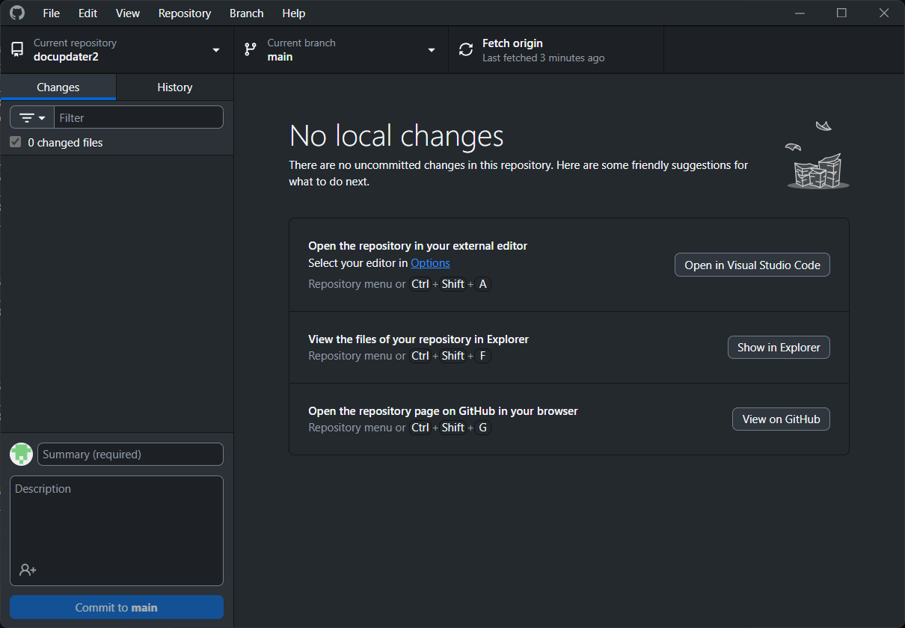
**Figure 3.5: History View Icon**

Clicking on a commit in the History view allows you to inspect the changes introduced by that specific commit.

#### 3.2.3. Branches View

The Branches view, accessible via the View menu or the Current Branch selector, provides a dedicated interface for managing all branches in your repository. Here you can search, create, rename, or delete branches, and manage pull requests.

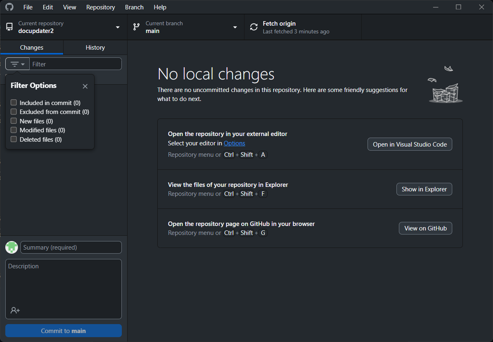
**Figure 3.6: Branches View**

This view typically includes a filter to quickly find specific branches and tabs to switch between local branches and pull requests.

#### 3.2.4. Filtering Files in Changes View

Within the **Changes** view, a "Filter" input field allows you to quickly locate specific files among your modifications, especially useful in large projects with many pending changes.

**Figure 3.7: Filter Field in Changes View**

You can type part of a filename into the filter box to show only matching files.

### 3.3. Commit Area

Located at the bottom of the left sidebar, the commit area is where you prepare and finalize your commits.

#### 3.3.1. Summary and Description

Before committing changes, you must provide a **Summary** (required) which is a concise commit message. Optionally, you can add a more detailed **Description** to provide context for your changes.

**Figure 3.8: Commit Summary and Description Fields**

#### 3.3.2. Adding Co-authors and Emojis

Below the description field, an icon allows you to add co-authors to your commit or include emojis in your commit message for better expressiveness.

**Figure 3.9: Co-authors and Emojis Option**

#### 3.3.3. Committing Changes

Once you have staged your desired changes and provided a commit message, click the **Commit to [branch name]** button to save your changes to the local repository history.

**Figure 3.10: Commit Button**

The button will display the name of the branch you are committing to (e.g., `Commit to main`).

## 4. Menu Bar Reference

The menu bar at the top of the GitHub Desktop window provides access to a wide range of application-level and repository-specific actions.

### 4.1. File Menu

The **File** menu contains options related to repository creation, management, and general application settings.

**Figure 4.1: File Menu Options**

*   **New repository... (Ctrl+N):** Create a new local repository. (Refer to Section 2.2)
*   **Add local repository... (Ctrl+O):** Add an existing local Git repository to GitHub Desktop. (Refer to Section 2.3)
*   **Clone repository... (Ctrl+Shift+O):** Clone a remote repository to your local machine. (Refer to Section 2.4)
*   **Options... (Ctrl+,):** Open the application settings and preferences. (Refer to Section 6.1)
*   **Exit (Alt+F4):** Close the GitHub Desktop application.

### 4.2. Edit Menu

The **Edit** menu provides standard text editing functionalities, useful when interacting with text fields within the application, such as commit messages.

**Figure 4.2: Edit Menu Options**

*   **Undo (Ctrl+Z):** Revert the last action.
    
*   **Redo (Ctrl+Y):** Re-apply the last undone action.
    
*   **Cut (Ctrl+X):** Remove selected content and copy it to the clipboard.
    
*   **Copy (Ctrl+C):** Copy selected content to the clipboard.
    
*   **Paste (Ctrl+V):** Insert content from the clipboard.
    
*   **Select all (Ctrl+A):** Select all content in the current context (e.g., a text field).
    
*   **Find (Ctrl+F):** Open a search bar to find specific text within the current context.
    

### 4.3. View Menu

The **View** menu controls the display of various interface elements and allows switching between different repository views.

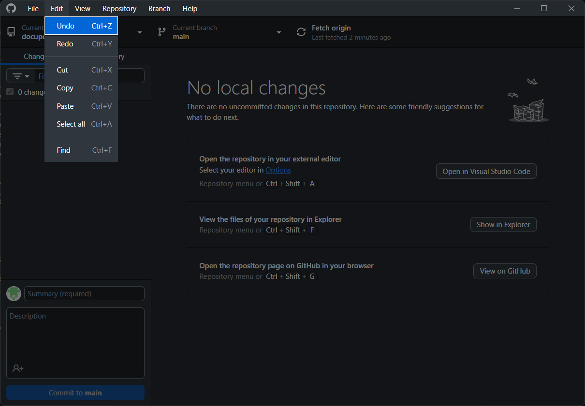
**Figure 4.3: View Menu Options**

*   **Changes (Ctrl+1):** Switch to the "Changes" view in the left sidebar. (Refer to Section 3.2.1)
*   **History (Ctrl+2):** Switch to the "History" view in the left sidebar. (Refer to Section 3.2.2)
*   **Repository list (Ctrl+T):** Show/hide the list of repositories in the left panel.
*   **Branches list (Ctrl+B):** Show/hide the Branches view (Refer to Section 3.2.3).
*   **Go to Summary (Ctrl+G):** Focus on the commit summary field.
*   **Show staged changes (Ctrl+H):** Toggle visibility of staged changes.
*   **Hide Toggle Changes Filter (Ctrl+L):** Toggle the visibility of the filter box in the Changes view.
*   **Toggle full screen (F11):** Switch the application to full-screen mode.
*   **Reset zoom (Ctrl+0), Zoom in (Ctrl+=), Zoom out (Ctrl+-):** Adjust the application's zoom level.
*   **Expand active resizable / Contract active resizable (Ctrl+9):** Adjust the size of active panels.
*   **Toggle developer tools (Ctrl+Shift+I):** Open developer tools for debugging (for advanced users).

### 4.4. Repository Menu

The **Repository** menu offers actions specific to the currently active repository, including synchronization and external tool integration.

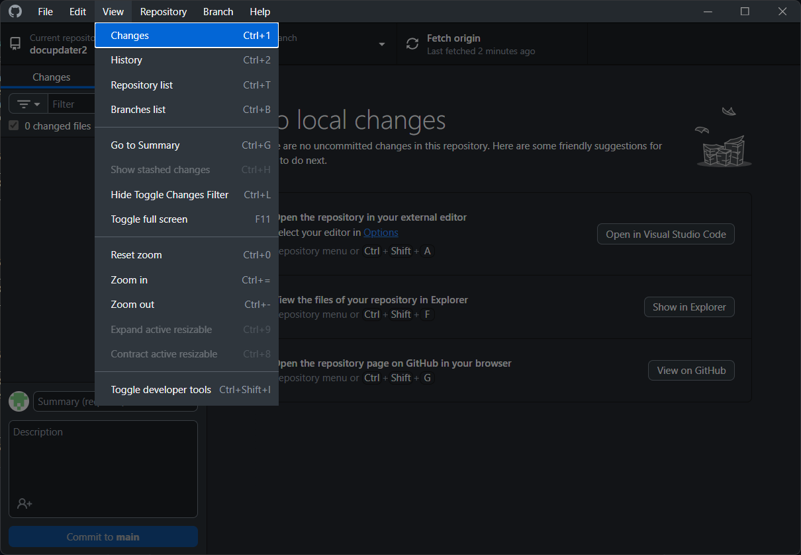
**Figure 4.4: Repository Menu Options**

*   **Push (Ctrl+P):** Upload local commits to the remote repository.
*   **Pull (Ctrl+Shift+P):** Download commits from the remote repository and integrate them into your local branch.
*   **Fetch (Ctrl+Shift+I):** Download new commits and branches from the remote, but do not integrate them. (Refer to Section 3.1.3)
*   **Remove... (Ctrl+Backspace):** Remove the current repository from GitHub Desktop (does not delete local files).
*   **View on GitHub (Ctrl+Shift+G):** Open the repository's page on GitHub.com in your web browser.
*   **Open in Command Prompt / Open in Terminal (Ctrl+`):** Open a command-line interface directly within the repository's directory.
*   **Show in Explorer / Show in Finder (Ctrl+Shift+F):** Open the repository's directory in your operating system's file browser.
*   **Open in Visual Studio Code / Open in external editor (Ctrl+Shift+A):** Open the current repository in your configured external editor.
    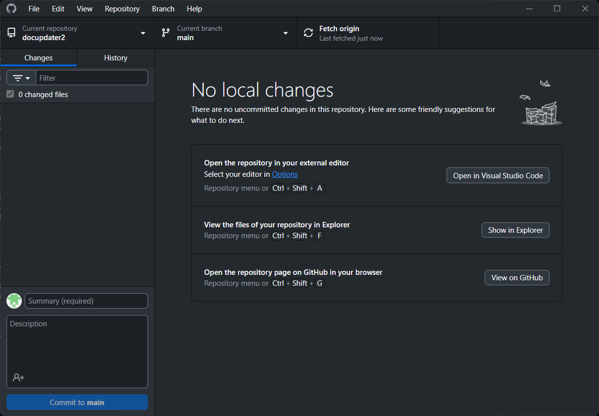
    **Figure 4.5: Open in External Editor Button (Contextual)**
*   **Create issue on GitHub (Ctrl+I):** Quickly navigate to create a new issue for the repository on GitHub.com.
*   **Repository settings...:** Open specific settings for the current repository. (Refer to Section 6.2)
    
    **Figure 4.6: Repository Options Link (Contextual)**

### 4.5. Branch Menu

The **Branch** menu provides comprehensive tools for managing branches, including creation, switching, merging, and rebasing.

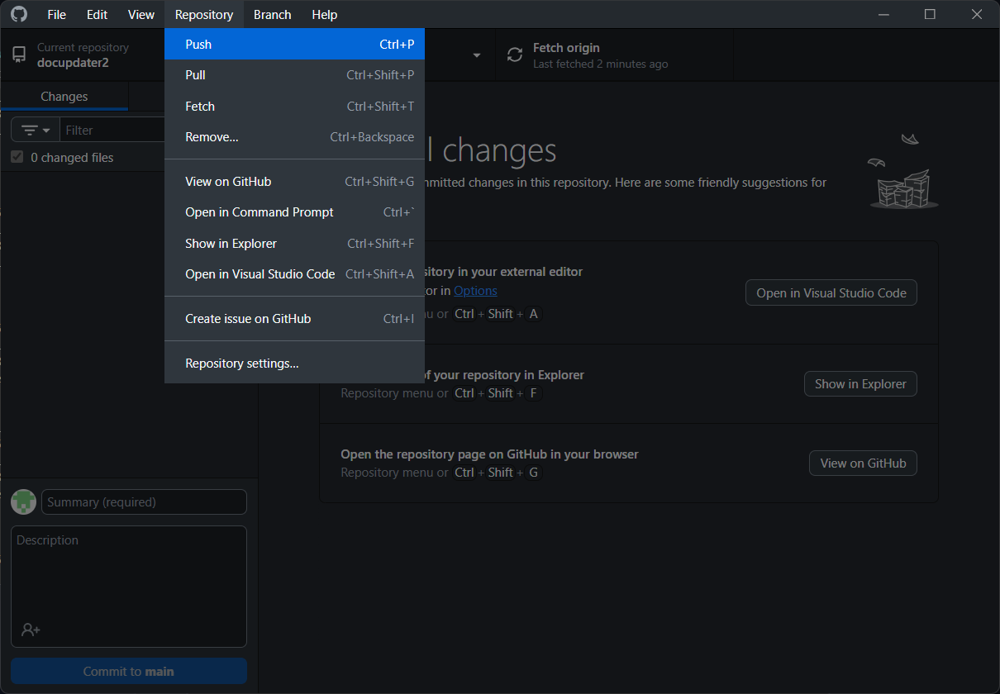
**Figure 4.7: Branch Menu Options**

*   **New branch... (Ctrl+Shift+N):** Create a new branch from the current branch.
*   **Rename... (Ctrl+Shift+R):** Rename the current branch.
*   **Delete... (Ctrl+Shift+D):** Delete the current branch (requires caution).
*   **Discard all changes... (Ctrl+Shift+Backspace):** Revert all local changes in the current branch to the last commit.
*   **Stash all changes (Ctrl+Shift+S):** Temporarily save your uncommitted changes without committing them, allowing you to switch branches.
*   **Update from main (Ctrl+Shift+U):** Pull changes from the default branch (e.g., `main`) into your current branch.
*   **Compare to branch... (Ctrl+Shift+B):** Compare the current branch with another branch.
*   **Merge into current branch... (Ctrl+Shift+M):** Integrate changes from another branch into your current branch.
*   **Squash and merge into current branch... (Ctrl+Shift+H):** Integrate changes from another branch into your current branch, combining all commits into a single new commit.
*   **Rebase current branch... (Ctrl+Shift+E):** Reapply commits from your current branch on top of another branch.
*   **Compare on GitHub (Ctrl+Shift+C):** Open a comparison view on GitHub.com for the current branch.
*   **View branch on GitHub (Ctrl+Shift+B):** Open the branch's page on GitHub.com in your web browser.
*   **Preview pull request (Ctrl+Alt+P):** View a preview of a potential pull request.
*   **Create pull request (Ctrl+R):** Initiate the process of creating a pull request on GitHub.com for the current branch.

### 4.6. Help Menu

The **Help** menu provides access to documentation, support resources, and information about the application.

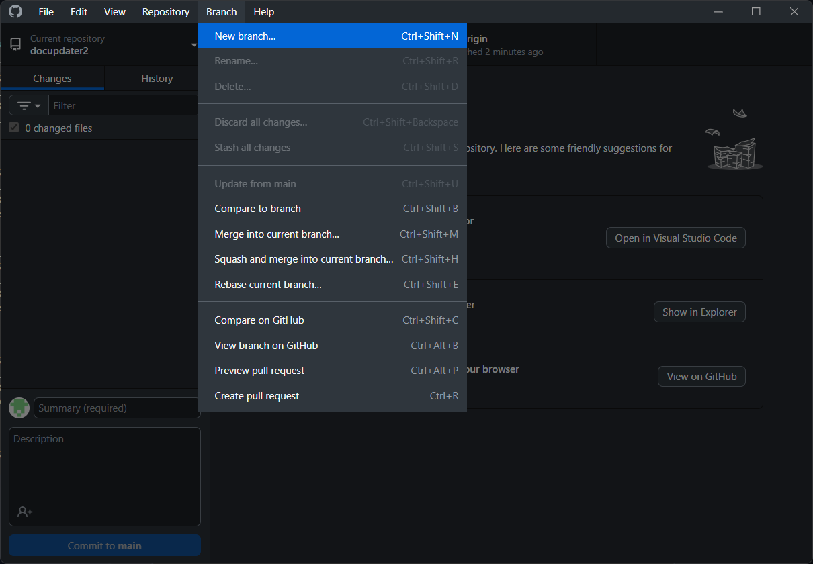
**Figure 4.8: Help Menu Options**

*   **Keyboard Shortcuts:** View a list of available keyboard shortcuts.
*   **Show Logs:** Open the application's log files, useful for troubleshooting.
*   **Report Bug...:** Open a link to report bugs or issues with GitHub Desktop.
*   **About GitHub Desktop:** Display information about the application version and licensing.

## 5. Core Workflow: Managing Your Code

This section details the fundamental actions for managing code changes within your repository using GitHub Desktop.

### 5.1. Inspecting and Staging Changes

When you modify files in your repository, these changes appear in the **Changes** view.

1.  **View Changes:** Open the **Changes** tab in the left sidebar (Figure 3.4).
    
    **Figure 5.1: Changes View with Pending Changes**
    The main content area will display a list of all modified files. For each file, you can see a diff highlighting additions, deletions, and modifications.
2.  **Stage Changes:** To include a file's changes in your next commit, check the checkbox next to its name in the file list. You can stage individual files or all files.

### 5.2. Committing Changes

After staging your desired changes, you need to commit them to your local repository's history.

1.  **Add Commit Summary:** In the **Summary** field (Figure 3.8), provide a concise description of your changes. This field is required.
2.  **Add Description (Optional):** In the **Description** field, provide more detailed context or reasoning for your commit.
3.  **Commit to Branch:** Click the **Commit to [branch name]** button (Figure 3.10) to finalize the commit. Your staged changes are now part of your branch's history.

### 5.3. Syncing with Remote: Fetch, Pull, Push

Keeping your local repository synchronized with its remote counterpart is crucial for collaboration.

*   **Fetch:** Click **Fetch origin** (Figure 3.3) to download new data from the remote repository without merging it into your local branch. This updates your knowledge of the remote's state.
*   **Pull:** To download remote changes and automatically merge them into your current local branch, go to **Repository > Pull** (Figure 4.4).
*   **Push:** To upload your local commits to the remote repository, making them available to others, go to **Repository > Push** (Figure 4.4). This is typically done after you've made and committed local changes.

### 5.4. Branch Management Operations

Branches allow you to work on new features or bug fixes in isolation from the main codebase.

#### 5.4.1. Switching Branches

To switch between different branches:
1.  Click the **Current branch** dropdown in the top bar (Figure 3.2).
2.  Select the desired branch from the list.

Alternatively, you can access branch management through the **Branches** view (Figure 3.6) or **View > Branches list** (Figure 4.3).

#### 5.4.2. Creating a New Branch

To create a new branch:
1.  Ensure you are on the branch you want to base your new branch off of.
2.  Go to **Branch > New branch...** (Figure 4.7).
3.  Enter a name for your new branch and click **Create Branch**.

#### 5.4.3. Comparing and Merging Branches

GitHub Desktop simplifies the process of integrating changes between branches.
*   **Compare to branch:** Use **Branch > Compare to branch...** (Figure 4.7) to see the differences between your current branch and another branch.
*   **Merge into current branch:** Use **Branch > Merge into current branch...** (Figure 4.7) to bring changes from another branch into your current working branch. This creates a merge commit.
*   **Rebase current branch:** Use **Branch > Rebase current branch...** (Figure 4.7) to reapply your branch's commits on top of another branch, maintaining a cleaner linear history.

#### 5.4.4. Discarding and Stashing Changes

*   **Discard all changes:** If you want to undo all uncommitted modifications in your current branch, go to **Branch > Discard all changes...** (Figure 4.7). **Use with caution, as this action cannot be easily undone.**
*   **Stash all changes:** To temporarily save your uncommitted changes without committing them, go to **Branch > Stash all changes** (Figure 4.7). This is useful when you need to switch branches quickly but aren't ready to commit your current work.

#### 5.4.5. Working with Pull Requests

GitHub Desktop integrates with GitHub.com to streamline the pull request workflow.
*   **Create pull request:** After pushing your new branch with changes, you can initiate a pull request by going to **Branch > Create pull request** (Figure 4.7). This opens a browser window to GitHub.com, pre-filling the pull request details.
*   **Preview pull request:** Use **Branch > Preview pull request** (Figure 4.7) to view the details of a pull request.

## 6. Advanced Features and Settings

This section covers application-wide preferences and repository-specific configurations.

### 6.1. Application Options

To configure global settings for GitHub Desktop:
1.  Go to **File > Options...** (Figure 4.1).

**Figure 6.1: Application Options**

This dialog typically includes settings for:
*   **Accounts:** Manage your GitHub.com and GitHub Enterprise accounts.
*   **Git:** Configure your Git user name and email.
*   **Integrations:** Set up external editors (e.g., Visual Studio Code, Atom).
*   **Advanced:** General settings like default branch name, shell integration, and theme.

### 6.2. Repository Settings

Each repository can have its own specific settings.
1.  Ensure the desired repository is active.
2.  Go to **Repository > Repository settings...** (Figure 4.4).

This dialog allows you to configure specific details for the current repository, such as its name, remote URL, or ignore patterns.

### 6.3. External Editor Integration

GitHub Desktop allows seamless integration with external code editors, enabling you to open your repository's files directly in your preferred development environment.
*   **Configure Editor:** You can set your default external editor via **File > Options... > Integrations** (Figure 6.1) or by clicking the **Options** link in the main content area when no changes are present (Figure 4.6).
*   **Open in Editor:** Once configured, you can open your repository in the external editor by clicking the **Open in [Editor Name]** button in the main interface (Figure 4.5) or via **Repository > Open in external editor** (Figure 4.4).

## 7. Troubleshooting and Support

If you encounter issues while using GitHub Desktop:
*   **Consult Logs:** Go to **Help > Show Logs** (Figure 4.8) to view the application's diagnostic logs, which can help in identifying problems.
*   **Report a Bug:** If you discover a bug, use **Help > Report Bug...** (Figure 4.8) to submit an issue to the GitHub Desktop development team.
*   **GitHub Documentation:** Refer to the official GitHub Desktop documentation online for in-depth articles and troubleshooting guides.