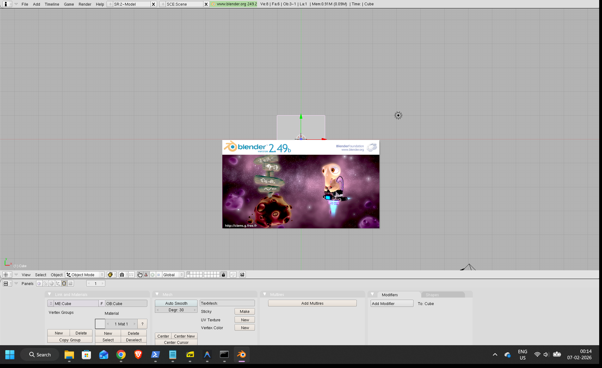
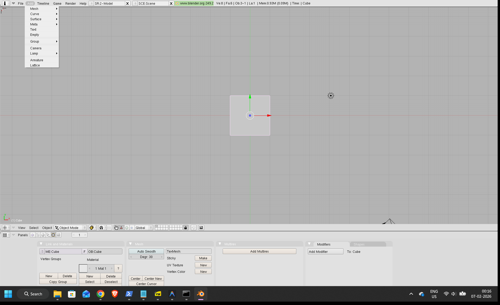
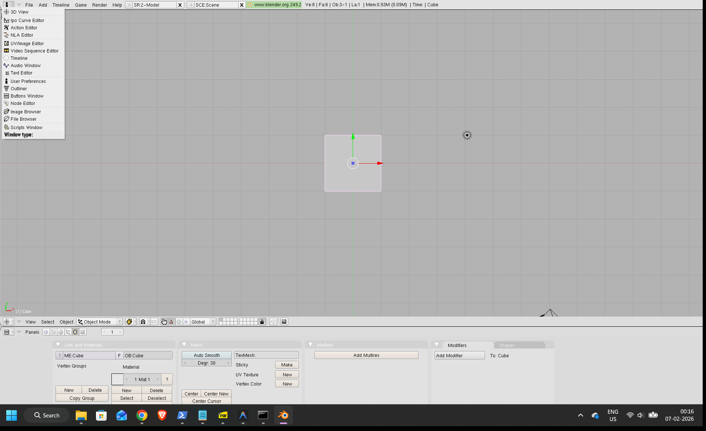
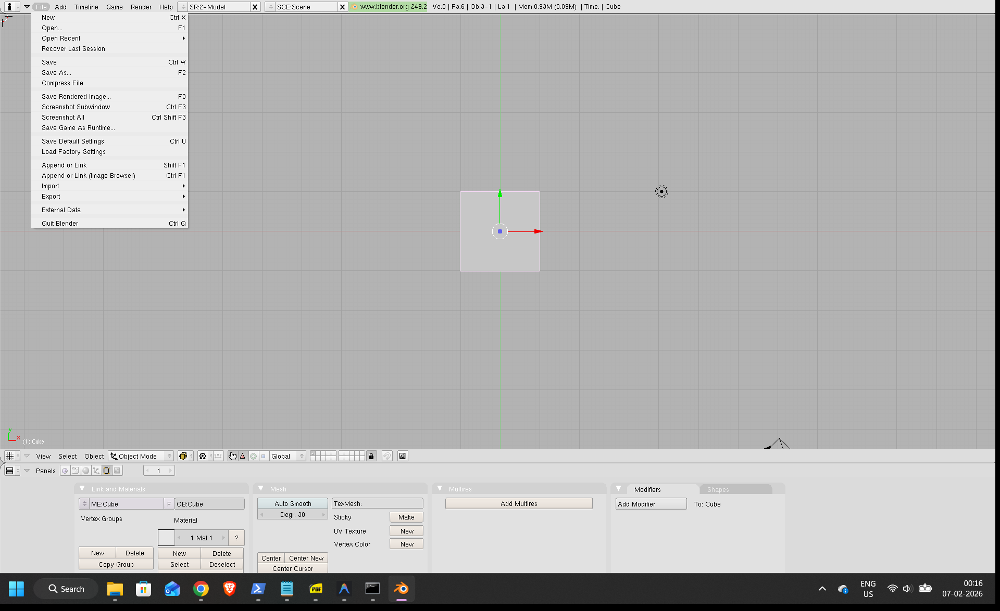
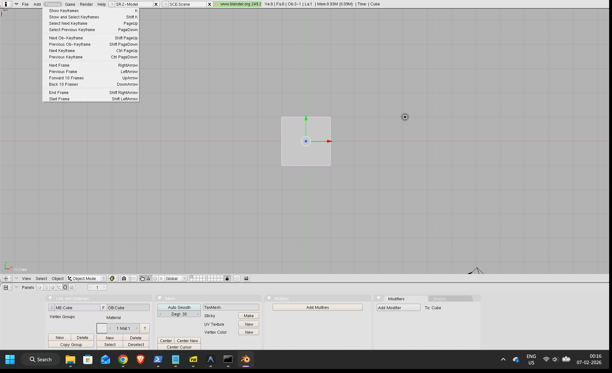
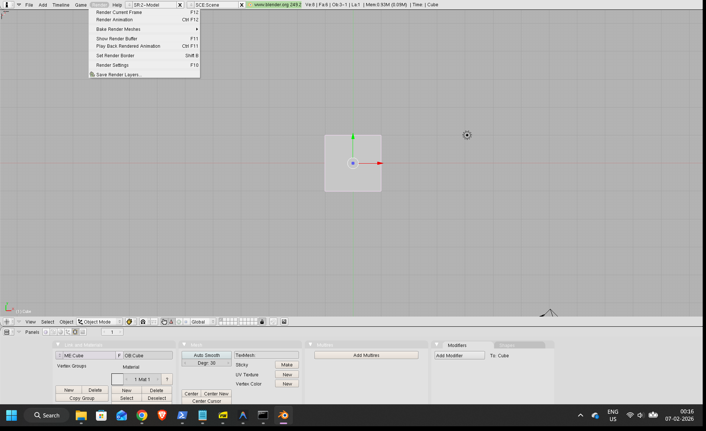
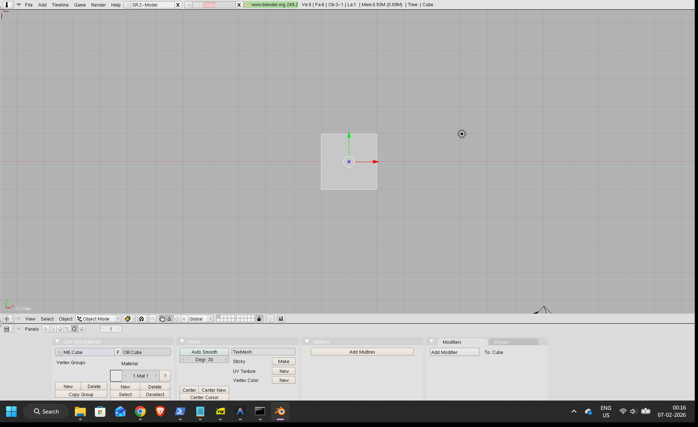
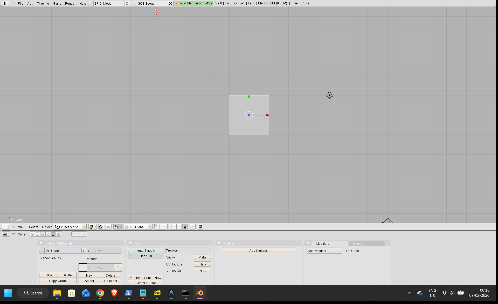

This manual is designed to guide users through the functionalities of **Blender**, a powerful 3D modeling and animation software, as depicted in the provided screenshots.

***Important Note:*** *The prompt specifically mentioned 'vlc', but the provided screenshots clearly show the user interface of **Blender**, a 3D modeling and animation application. This manual has been created based on the visual evidence from the screenshots, addressing Blender's features within the context of 3D modeling and animation. If 'vlc' was intended to refer to a different application, please clarify.*

---

# User Manual: Blender (3D Modeling & Animation Software)

Blender is a free and open-source 3D creation suite. It supports the entirety of the 3D pipeline—modeling, rigging, animation, simulation, rendering, compositing and motion tracking, even video editing and game creation. This manual will walk you through the basic interface and common operations using the provided visual aids.

## 1. Getting Started

When you launch Blender, you'll be greeted by a splash screen, followed by the main interface.

### 1.1 Application Start

Upon launching Blender, you'll see a splash screen (often displaying the Blender logo and version, in this case, a stylized image with "blender 2.49b"). After the splash screen disappears, the main workspace will load. The default scene usually includes a cube, a lamp, and a camera, ready for you to begin your 3D work.

## 2. Interface Overview

Blender's interface is highly customizable and composed of multiple "windows" or "editors" that can be rearranged and resized. The top bar contains global menus and scene information. The 3D Viewport is where most of your modeling and animation work takes place.

### 2.1 Changing Window Types

Blender allows you to customize your workspace by changing the type of editor displayed in any area.

1.  **Click the Window Type Selector:** In the top-left corner of any editor (often represented by an icon, like the `i` or `^` in older versions), click this button. This opens a dropdown menu listing all available editor types.

2.  **Select a New Window Type:** From the dropdown, you can select different editor types like "Timeline," "UV/Image Editor," "Node Editor," etc. Clicking "Timeline" will change the current editor area to display the animation timeline.

### 2.2 Top Menu Bar

The top menu bar provides access to global file operations, adding objects, rendering, and help.

#### 2.2.1 File Menu

Clicking **File** opens a standard menu for managing your Blender projects:
*   **New (Ctrl+N):** Starts a new blank project.
*   **Open (Ctrl+O):** Loads an existing Blender file (`.blend`).
*   **Save (Ctrl+S):** Saves the current project.
*   **Save As... (Shift+Ctrl+S):** Saves the current project under a new name or location.
*   **Import/Export:** Options to bring in or send out 3D models and data in various formats (e.g., OBJ, FBX).
*   **Quit Blender (Ctrl+Q):** Exits the application.

#### 2.2.2 Add Menu

The **Add** menu is crucial for populating your scene with new elements:
*   **Mesh:** Add primitive 3D shapes like cubes, spheres, cylinders, planes, etc.
*   **Curve:** Add 2D or 3D curves for modeling, paths, or animation.
*   **Surface:** Add NURBS surfaces.
*   **Text:** Add 3D text objects.
*   **Lamp:** Add light sources (e.g., Sun, Spot, Hemi, Area).
*   **Camera:** Add new cameras to your scene.
*   **Empty:** Add a non-rendering object used as a parent for other objects or for transformations.
*   **Armature:** Add a skeleton for character rigging.
*   **Lattice:** Add a deformation cage.

#### 2.2.3 Game Menu

Blender includes a built-in game engine. The **Game** menu provides options related to it:
*   **Start Game:** Launches the interactive game engine viewport.
*   **Show and Select Keyframes:** Used for animating game logic or object properties.
*   **Next/Previous Frame:** Navigate through the game timeline.

#### 2.2.4 Render Menu

The **Render** menu is where you initiate the final image or animation generation:
*   **Render Current Frame (F12):** Renders a still image of the current frame from the active camera's perspective.
*   **Render Animation (Ctrl+F12):** Renders all frames of the active animation into an image sequence or video file.
*   **Render Settings (F10):** Opens the rendering properties panel where you configure output format, resolution, anti-aliasing, and more.
*   **Show Render Buffer (F11):** Displays the last rendered image.

### 2.3 Scene and Model Tabs

Blender allows you to manage multiple scenes and models within a single project.

*   **Scene/Model Tabs:** These tabs, like `SR.2-Model` and `SCE:Scene`, allow you to quickly switch between different scenes or specific views/models you have saved as custom layouts within your Blender file. They help organize complex projects.

*   **SCE:Scene Tab:** This specifically refers to a Blender Scene. You can have multiple scenes in a single `.blend` file, each with its own objects, cameras, lights, and render settings.

*   **Information/Web Tabs:** This tab, labeled `www.blender.org 249.2`, might be a built-in browser window displaying news, tutorials, or the official Blender website, especially in older versions where such integrations were more common. It could also be a custom information panel.

## 3. 3D Viewport Controls

The 3D Viewport is your primary window for interacting with 3D objects. Its header provides tools for viewing, selecting, and manipulating objects.

### 3.1 Viewport Layout and Navigation

#### 3.1.1 View Menu

Clicking **View** in the 3D Viewport header provides options for camera control and display:
*   **Viewpoint:** Switch to predefined views (e.g., Front, Back, Top, Bottom, Left, Right, Camera).
*   **Align View:** Align the view to selected objects or faces.
*   **Toggle Quad View:** Splits the viewport into four views (top, front, right, camera).

*   **View Layout Options:** Some "View" menus also offer options to manage the overall layout of the 3D viewport, such as displaying tool shelves or properties panels.

### 3.2 Selection Tools

The **Select** menu offers various ways to choose objects or components.

Clicking **Select** gives you options for selecting elements in your scene:
*   **All (A):** Selects/deselects all visible objects.
*   **Box Select (B):** Draws a box to select multiple items.
*   **Circle Select (C):** Paints a circle to select multiple items.
*   **Border Select (Ctrl+B):** Selects faces within a defined boundary.
*   **Inverse (Ctrl+I):** Inverts the current selection.

### 3.3 Object Manipulation

The **Object** menu provides operations that apply to entire objects.

Clicking **Object** offers commands for object-level operations:
*   **Transform:** Apply location, rotation, and scale.
*   **Mirror:** Mirror an object along an axis.
*   **Duplicate (Shift+D):** Creates a copy of the selected object.
*   **Join (Ctrl+J):** Combines multiple selected objects into one.
*   **Parent:** Establishes parent-child relationships between objects.

### 3.4 Mode Selection

Blender operates in different "modes" for different tasks (e.g., editing geometry vs. posing an armature).

Clicking the **Mode Selector** (e.g., "Object Mode" button) allows you to switch between various modes:
*   **Object Mode:** For manipulating entire objects (moving, rotating, scaling, parenting). This is the default mode.
*   **Edit Mode:** For modifying the mesh geometry (vertices, edges, faces) of an object.
*   **Sculpt Mode:** For sculpting meshes like digital clay.
*   **Vertex Paint Mode:** For painting colors directly onto vertices.
*   **Weight Paint Mode:** For assigning weights to vertices for armature deformation.
*   **Pose Mode:** For posing rigged characters.

#### 3.4.1 Component Selection (Edit Mode)

When in **Edit Mode**, you can specify which components of a mesh you want to select and manipulate.

*   **Vertex Select:** Allows you to select and manipulate individual vertices (points) of a mesh.

*   **Edge Select:** Allows you to select and manipulate edges (lines connecting two vertices) of a mesh.

*   **Face Select:** Allows you to select and manipulate faces (flat surfaces defined by edges) of a mesh.

### 3.5 Transformation Tools and Options

These icons control how transformations (move, rotate, scale) behave.

#### 3.5.1 Proportional Editing

*   **Proportional Editing (O):** When enabled, transformations applied to selected elements will also affect nearby unselected elements, with the influence decreasing with distance. This is useful for smooth deformations. Clicking the icon toggles it on/off and can reveal falloff options.

#### 3.5.2 Pivot Point Options

*   **Pivot Point Options:** Defines the center point around which transformations (rotation, scaling) occur. Options include `Median Point`, `Active Element`, `Individual Origins`, `3D Cursor`, and `Bounding Box Center`.

#### 3.5.3 Snapping

*   **Snapping (Shift+Tab):** When enabled, objects or components will "snap" to other elements (e.g., grid, vertices, edges, faces) during transformations, ensuring precision. Clicking the icon toggles it on/off and reveals snapping options.

#### 3.5.4 Transform Orientation

*   **Transform Orientation:** Determines the coordinate system used for transformations. Options include `Global`, `Local`, `Normal`, `Gimbal`, `View`.

*   **Global Orientation:** Transformations are aligned to the global X, Y, Z axes of the scene.

*   **Lock Axis:** This is usually a toggle or part of a transformation setting, allowing you to restrict movement, rotation, or scaling to specific axes (e.g., only move along X, Y, or Z).

### 3.6 Viewport Display Modes and Overlays

These settings control how objects are displayed in the 3D Viewport.

#### 3.6.1 Viewport Shading

*   **Viewport Display Mode / Shading:** This dropdown or set of buttons controls how objects are visually represented in the 3D Viewport. Common modes include:
    *   **Wireframe:** Shows only the edges of the mesh.
    *   **Solid:** Displays objects as solid surfaces.
    *   **Shaded:** Displays objects with basic lighting and shading.
    *   **Textured:** Displays objects with their assigned textures.
    *   **Rendered:** Shows a preview of the final render (can be resource-intensive).

*   **Viewport Shading (Expanded):** This is often the same control as "Viewport Display Mode," just with the dropdown opened to show available options.

#### 3.6.2 Toggle Overlays

*   **Toggle Overlays (Eye Icon):** This icon controls the visibility of various non-rendering elements in the 3D Viewport, such as the grid, origins, annotations, and specific object types. Clicking it opens a menu of options.

#### 3.6.3 Overlay Visibility Options

When the Toggle Overlays menu is open, you can selectively hide or show specific elements.

*   **Show Objects:** Toggles the visibility of all 3D objects (meshes, curves, etc.) in the viewport overlays.

*   **Show Lamps:** Toggles the visibility of lamp (light) icons in the viewport. This helps declutter the view when working on models without affecting their lighting.

*   **Show Cameras:** Toggles the visibility of camera icons in the viewport. Useful when focusing on modeling rather than camera placement.

## 4. Tips for Beginners

*   **Experiment:** Don't be afraid to click buttons and try out different settings. You can always undo actions (Ctrl+Z) or restart with a new file.
*   **Keyboard Shortcuts:** Blender is highly reliant on keyboard shortcuts. Learning common ones will significantly speed up your workflow.
*   **Save Frequently:** Always save your work regularly (Ctrl+S) to avoid losing progress.
*   **Online Resources:** Blender has a vast online community, tutorials, and documentation available. The official website (blender.org) is a great starting point.
*   **Context Sensitivity:** Many menus and tools change based on the active mode (Object Mode, Edit Mode, etc.) and what is currently selected.

## 5. Conclusion

This manual provides a foundational understanding of Blender's interface and core functionalities based on the provided screenshots. As you become more familiar with the software, you'll discover its immense power and flexibility for all your 3D modeling and animation needs. Happy creating!