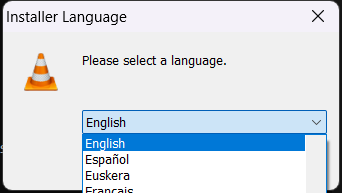
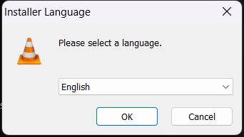

# VLC Media Player: Comprehensive Installation Guide

## Title
VLC Media Player Installation Guide for Windows

## Overview
This guide provides step-by-step instructions for installing VLC Media Player on a Windows operating system. VLC Media Player is a free and open-source, portable, cross-platform media player and streaming media server developed by the VideoLAN project. It supports almost all video and audio file formats, DVDs, Audio CDs, VCDs, and various streaming protocols. Following this guide will ensure a smooth and successful installation process.

## System Requirements
Before proceeding with the installation, ensure your system meets the following requirements:

*   **Operating System:** Windows 7, Windows 8, Windows 8.1, Windows 10, or Windows 11.
*   **Processor:** x86, x64, or ARM processor. A modern multi-core processor is recommended for optimal performance with high-definition content.
*   **RAM:** 512 MB of RAM (1 GB or more recommended).
*   **Hard Disk Space:** Approximately 300 MB of free disk space for the installation, plus additional space for media files.
*   **Administrative Rights:** You must have administrator privileges on your computer to install software.
*   **Internet Connection:** An internet connection is required to download the VLC installer, but not for the installation or usage of the player itself.

## Installation Steps
Follow these steps carefully to install VLC Media Player on your system.

### **Step 1: Initial Installer Language Prompt**
After launching the VLC installer executable (e.g., `vlc-x.x.x-win64.exe`), the first window you will see is the "Installer Language" dialog. This screen prompts you to select the language for the installation process. By default, "English" is often pre-selected.

**Action:** Review the default language selection. If "English" is your preferred language, you are ready to proceed to the next step.

### **Step 2: Confirm Language Selection (Initial)**
This screen is a confirmation of the language selection made in the previous step. It displays the chosen language (typically English) and provides an "OK" button to continue.

**Action:** To confirm your language selection and continue with the installation, click the **OK** button.

### **Step 3: Confirm Language Selection (Secondary)**
This step reiterates the confirmation of your chosen installer language. You will see the same "Installer Language" dialog with "English" selected and the "OK" button available.

**Action:** Click **OK** to re-confirm the selected language and advance further into the installation wizard.

### **Step 4: Selecting the Installer Language**
This dialog shows the expanded dropdown menu for language selection, with "English" highlighted. This is where you would actively choose a different language if needed.

**Action:** If "English" is your desired language for the installer, ensure it is highlighted. If you wish to change the language, click on your preferred language from the list to select it.

### **Step 5: Final Language Confirmation**
After confirming or making any changes to the language selection, this screen again presents the "Installer Language" dialog with your final choice ("English" in this case) and the "OK" button.

**Action:** Click **OK** to finalize your installer language choice and proceed to the main installation wizard steps (such as license agreement, component selection, and installation directory, which are not covered by the provided screenshots).

## Post-Installation
Once the installation wizard completes (after the steps shown above), you typically have the option to:

1.  **Launch VLC Media Player:** A checkbox to "Run VLC media player" is usually present on the final installation screen. If checked, VLC will launch immediately after you click "Finish."
2.  **Desktop Shortcut:** A desktop shortcut icon for VLC Media Player will be created by default, allowing you to easily launch the application.
3.  **Start Menu Entry:** VLC Media Player will be accessible from your Windows Start Menu under "VideoLAN."

Upon the first launch, VLC might ask you about privacy preferences, such as allowing metadata network access. Configure these settings according to your preference.

## Troubleshooting
If you encounter issues during or after the installation, consider the following troubleshooting tips:

*   **Administrator Rights:** Ensure you are running the installer with administrative privileges. Right-click the installer file and select "Run as administrator."
*   **Corrupt Installer:** If the installer fails to launch or encounters errors early on, the downloaded file might be corrupt. Re-download the installer from the official VideoLAN website (www.videolan.org).
*   **System Requirements:** Double-check that your computer meets the minimum system requirements listed in this guide.
*   **Antivirus/Firewall Interference:** Temporarily disable your antivirus software or firewall during the installation process, as they might sometimes block legitimate installer actions. Remember to re-enable them immediately after installation.
*   **Insufficient Disk Space:** Verify that you have enough free disk space on the drive where you are installing VLC.
*   **Previous Installations:** If you had a previous version of VLC installed and are experiencing issues, try uninstalling the old version completely (including any leftover files in Program Files and AppData folders) before attempting a new installation.
*   **Check Event Viewer:** For more advanced troubleshooting, check the Windows Event Viewer for any error messages related to the installation process.

If problems persist, consult the official VLC Media Player documentation or community forums for further assistance.